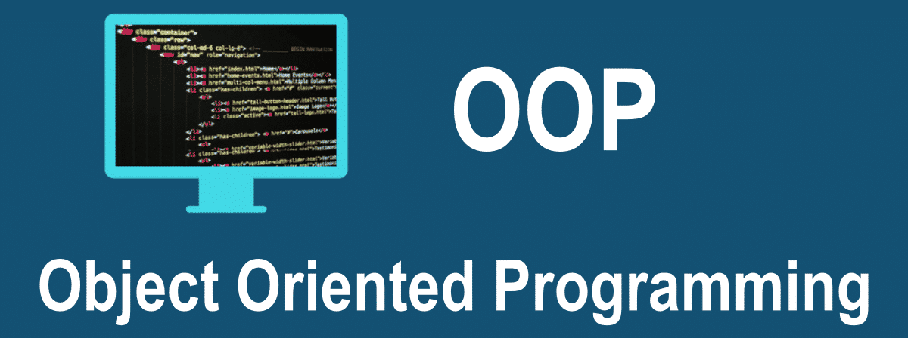

# Curso de PHP OOP código 49163

> Curso de PHP Object Oriented Programming |  
> Martes 19hs (Arg) |  
> Código: 49163 |  
> sensei: Marcos Pinardi |

## Definición: OOP vs Procedural

> Cuando programamos, procedural, programamos funciones.
> Y en esta modo de programar tenemos separados los datos de los procedimientos.

> En cambio cuando programamos orientado a objetos,
> estos estan íntimamente relacionados en lo que conocemos como **estado**.

## Extenisones recomendadas para VSC

    https://marketplace.visualstudio.com/items?itemName=phproberto.vscode-php-getters-setters
    
    https://marketplace.visualstudio.com/items?itemName=bmewburn.vscode-intelephense-client
    

